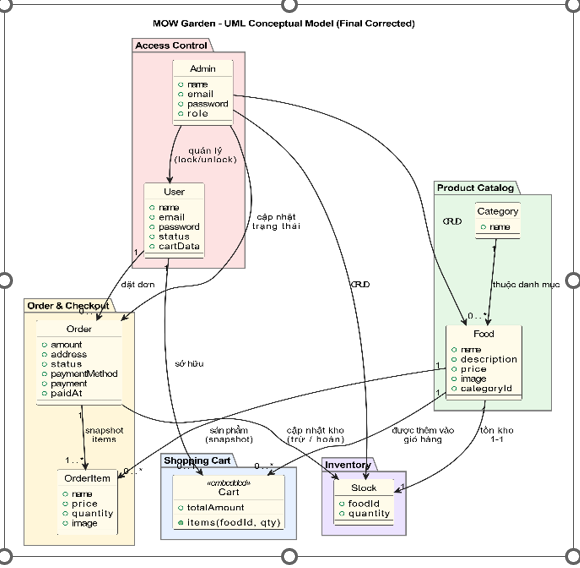
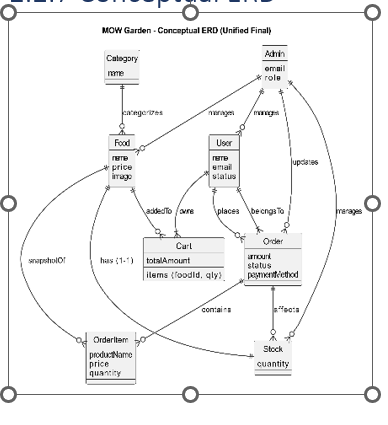
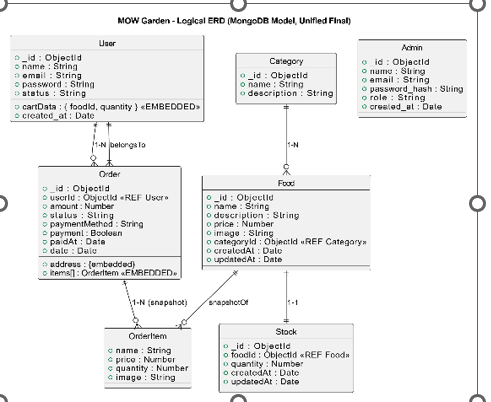
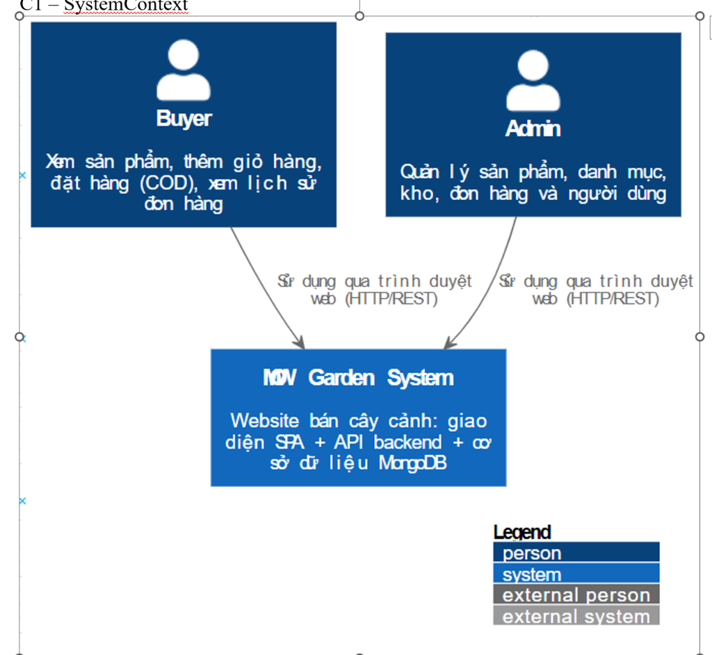
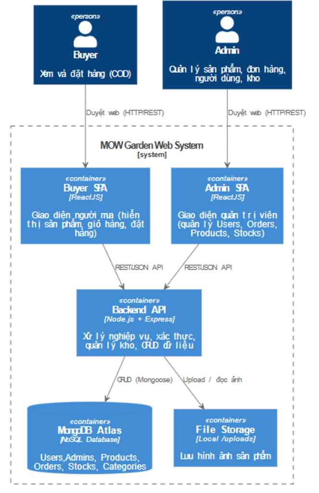

# 🍔 MOW GARDEN - Web bán cây

Chào mừng đến với **FoodFast**, đồ án môn học **Kiểm Thử Phần Mềm** (KTPM) tại Đại học Sài Gòn (SGU). Đây là một hệ thống đặt đồ ăn hoàn chỉnh bao gồm Website cho khách hàng, Trang quản trị (Admin Panel) và Backend API mạnh mẽ.


---

## 📑 Mục Lục

- [Giới Thiệu](#-giới-thiệu)
- [Tính Năng Chính](#-tính-năng-chính)
- [Công Nghệ Sử Dụng](#-công-nghệ-sử-dụng)
- [Cấu Trúc Dự Án](#-cấu-trúc-dự-án)
- [Cài Đặt & Chạy Dự Án](#-cài-đặt--chạy-dự-án)
- [Hướng Dẫn Kiểm Thử (Testing)](#-hướng-dẫn-kiểm-thử-testing)
- [API Documentation](#-api-documentation)
- [Tác Giả](#-tác-giả)

---

## 🚀 Giới Thiệu

**FoodFast** giải quyết bài toán đặt đồ ăn trực tuyến với trải nghiệm người dùng mượt mà và hệ thống quản lý chặt chẽ. Dự án tập trung vào việc áp dụng các quy trình kiểm thử phần mềm tự động (Automated Testing) từ Unit Test, Integration Test đến End-to-End (E2E) Test.

---

## ✨ Tính Năng Chính

### 👤 Khách Hàng (User Website)
- **Đăng ký/Đăng nhập:** Bảo mật với JWT.
- **Tìm kiếm & Duyệt món ăn:** Xem danh sách món ăn theo danh mục, lọc theo tiêu chí.
- **Giỏ hàng:** Thêm/Sửa/Xóa món ăn, tự động tính tổng tiền.
- **Đặt hàng:** Hỗ trợ thanh toán khi nhận hàng (COD).
- **Lịch sử đơn hàng:** Theo dõi trạng thái đơn hàng (Đang xử lý, Đang giao, Đã giao).

### 🛡️ Quản Trị Viên (Admin Panel)
- **Dashboard:** Xem thống kê tổng quan về đơn hàng, doanh thu.
- **Quản lý Món ăn:** Thêm, sửa, xóa món ăn, cập nhật hình ảnh và giá.
- **Quản lý Đơn hàng:** Cập nhật trạng thái đơn hàng (Processing -> Out for delivery -> Delivered).
- **Quản lý Kho hàng:** Tự động trừ kho khi có đơn hàng, hoàn kho khi hủy đơn.

### ⚙️ Hệ Thống
- **Xác thực & Phân quyền:** Middleware bảo vệ các API quan trọng.
- **Quản lý Kho:** Logic trừ kho nguyên tử (Atomic), ngăn chặn bán quá số lượng (Overselling).
- **Upload hình ảnh:** Lưu trữ hình ảnh món ăn.

---

## � Thiết Kế Hệ Thống

### 1. Conceptual Model (Mô hình Khái niệm)
Mô tả các thực thể chính và mối quan hệ giữa chúng trong hệ thống.


### 2. Conceptual ERD (Sơ đồ Thực thể - Quan hệ Khái niệm)
Chi tiết hóa các thuộc tính và quan hệ ở mức khái niệm.


### 3. Logical ERD (Sơ đồ Thực thể - Quan hệ Logic)
Mô hình dữ liệu chi tiết được ánh xạ sang MongoDB (NoSQL).


### 4. Kiến trúc Hệ thống (C4 Model)

#### C1 - System Context (Ngữ cảnh Hệ thống)
Tổng quan về sự tương tác giữa người dùng và hệ thống FoodFast.


#### C2 - Container (Thành phần chứa)
Chi tiết các thành phần bên trong hệ thống: Web App, Admin Panel, API Backend, Database.


### 5. Domain-Driven Design (Subjects & Relations)

#### Khái niệm

Trong **MOW Garden**, “domain” là toàn bộ phạm vi nghiệp vụ liên quan đến hoạt động của cửa hàng cây cảnh trực tuyến. **Static View** mô tả cấu trúc tĩnh: dữ liệu nằm ở đâu, domain nào quản lý dữ liệu nào và các domain liên kết với nhau ra sao. Hệ thống được chia thành nhiều subdomain độc lập, mỗi subdomain đại diện cho một mảng nghiệp vụ riêng như quản lý sản phẩm, giỏ hàng hay xử lý đơn hàng COD. Mỗi subdomain có model, controller và quy tắc nghiệp vụ riêng. Khi kết hợp, các domain tạo nên quy trình xuyên suốt: người dùng đăng nhập, xem sản phẩm, thêm vào giỏ, đặt hàng COD, hệ thống trừ kho và quản trị viên theo dõi đơn.

#### Mô tả các Domain chính

**1) Access Control Domain – Xác thực và phân quyền**  
Access Control quản lý việc đăng ký và đăng nhập của Buyer cũng như đăng nhập của Admin. Buyer được lưu trong `userModel.js` với các trường như `name`, `email`, `password` (hash) và trạng thái tài khoản (unlock/lock). Mỗi tài khoản Buyer cũng chứa giỏ hàng riêng thông qua trường `cartData`. Admin dùng tài khoản có sẵn trong `adminModel.js` và có thể khóa hoặc mở khóa người dùng trong `adminUserController.js`. Domain này là nền tảng để các domain khác hoạt động vì mọi thao tác giỏ hàng, đặt hàng hay xem đơn đều yêu cầu người dùng đã xác thực.

**2) Product Catalog Domain – Quản lý sản phẩm và danh mục**  
Product Catalog quản lý toàn bộ dữ liệu về sản phẩm và danh mục. Mỗi sản phẩm trong `Food.js` gồm tên, mô tả, giá, hình ảnh và `categoryId`. Hệ thống đảm bảo không có hai sản phẩm trùng tên trong cùng danh mục nhờ unique index `{ name, categoryId }`. Khi admin thêm sản phẩm, controller tự động tạo thêm một record tồn kho tương ứng trong `Stock.js`. Khi sản phẩm bị xoá, hệ thống cũng xoá ảnh vật lý và stock đi kèm. Product Catalog cung cấp dữ liệu cho Shopping Cart và Order.

**3) Shopping Cart Domain – Giỏ hàng cá nhân của từng Buyer**  
Giỏ hàng được nhúng trực tiếp vào user qua trường `cartData` trong `userModel.js`. Điều này đảm bảo mỗi Buyer có đúng một giỏ hàng gắn với tài khoản. Trong `cartController.js`, người dùng có thể thêm sản phẩm, tăng giảm số lượng hoặc xoá khỏi giỏ. Khi người dùng tiến hành thanh toán, dữ liệu trong giỏ là nguồn tạo Order, và sau khi tạo đơn hàng thành công, giỏ được đặt lại rỗng. Domain này nối giữa Product Catalog và Order & Checkout.

**4) Order & Checkout Domain – Đặt hàng COD và vòng đời đơn hàng**  
Domain này xử lý việc chuyển giỏ hàng thành đơn hàng thực tế. `orderModel.js` lưu snapshot của sản phẩm tại thời điểm mua, tổng tiền (gồm phí ship), địa chỉ nhận hàng, trạng thái và phương thức thanh toán COD. Trong `orderController.js`, hàm `placeOrderCod` kiểm tra tồn kho, trừ kho bằng `decStock`, tạo đơn hàng và xoá giỏ của user. Trạng thái đơn hàng tuân theo ba giá trị: “Food Processing” cho đơn mới, “Delivered” khi giao và thu COD thành công, và “Canceled” khi huỷ đơn hàng (kèm hoàn kho bằng `incStock`). Domain này liên kết chặt với Cart, Inventory và Access Control.

**5) Inventory Domain – Quản lý tồn kho**  
Inventory theo dõi số lượng tồn của từng sản phẩm. Mỗi sản phẩm có một record stock trong `Stock.js`. Khi bán hàng thành công, tồn kho bị trừ; khi huỷ đơn, tồn kho được hoàn lại. Admin có thể nhập thêm hàng, thay đổi số lượng hoặc xoá dòng tồn kho. `stockController.js` và helper `updateStock.js` hỗ trợ việc trừ và hoàn kho đảm bảo nhất quán dữ liệu. Inventory là phần đảm bảo dữ liệu kho phản ánh đúng tình trạng bán hàng trong hệ thống.

#### Quan hệ giữa các Domain

Các domain trong **MOW Garden** liên kết theo dòng nghiệp vụ rõ ràng. **Access Control** đứng đầu vì người dùng phải được xác thực trước khi sử dụng giỏ hàng hay đặt hàng. **Shopping Cart** gắn trực tiếp vào Buyer và lưu lựa chọn mua hàng. Khi đặt hàng, giỏ hàng được chuyển thành Order nên giữa Cart và Order tồn tại mối quan hệ chuyển đổi. **Order** tác động lên **Inventory** bằng cách trừ hoặc hoàn kho. **Product Catalog** liên kết với Inventory ở mức cấu trúc: mỗi sản phẩm có đúng một record stock. Nhìn tổng thể, chuỗi domain phản ánh đúng luồng kinh doanh: đăng nhập → xem sản phẩm → thêm giỏ → đặt hàng COD → cập nhật kho.

#### Tổng kết

**MOW Garden** được tổ chức thành năm domain: Access Control, Product Catalog, Shopping Cart, Order & Checkout và Inventory. Các domain này tạo thành chuỗi nghiệp vụ hoàn chỉnh, phản ánh đúng quy trình mua bán ngoài đời: người dùng đăng nhập, duyệt sản phẩm, chọn mua, đặt hàng COD, hệ thống trừ kho và quản trị viên xử lý đơn. Mỗi domain có dữ liệu, controller và quy tắc riêng nhưng liên kết logic với nhau qua các khóa như `userId`, `foodId` và `stock`. Static View này là khung nền để hiểu toàn bộ kiến trúc backend và phục vụ cho các sơ đồ ở mức chi tiết hơn.

---

## �🛠 Công Nghệ Sử Dụng

| Thành phần | Công nghệ |
|------------|-----------|
| **Frontend** | ReactJS, Vite, CSS Modules |
| **Admin Panel** | ReactJS, Vite, React Router |
| **Backend** | Node.js, Express.js |
| **Database** | MongoDB, Mongoose |
| **Testing** | Vitest (Backend), Playwright (E2E) |
| **Tools** | Postman, Git, VS Code |

---

## 📂 Cấu Trúc Dự Án

```bash
SGU_KTPM_DO-AN/
├── backend/                # Server Node.js & API
│   ├── controllers/        # Xử lý logic nghiệp vụ
│   ├── models/             # Schema MongoDB
│   ├── routes/             # Định nghĩa API endpoints
│   ├── tests/              # Unit & Integration Tests (Vitest)
│   └── ...
├── frontend/               # Website cho người dùng (React + Vite)
├── admin/                  # Trang quản trị (React + Vite)
├── e2e-tests/              # Kiểm thử tự động E2E (Playwright)
└── README.md               # Tài liệu dự án
```

---

## 💻 Cài Đặt & Chạy Dự Án

### Yêu cầu tiên quyết
- Node.js (v16 trở lên)
- MongoDB (Local hoặc Atlas)
- Git

### Bước 1: Clone dự án
```bash
git clone https://github.com/Viet2707/SGU_KTPM_DO-AN.git
cd SGU_KTPM_DO-AN
```

### Bước 2: Cài đặt & Chạy Backend
```bash
cd backend
npm install
# Tạo file .env và cấu hình biến môi trường (DB_URL, JWT_SECRET,...)
npm start
# Server chạy tại: http://localhost:5000
```

### Bước 3: Cài đặt & Chạy Admin Panel
```bash
cd ../admin
npm install
npm run dev
# Admin chạy tại: http://localhost:5174
```

### Bước 4: Cài đặt & Chạy Frontend
```bash
cd ../frontend
npm install
npm run dev
# Website chạy tại: http://localhost:5173
```

---

## 🧪 Hướng Dẫn Kiểm Thử (Testing)

Dự án áp dụng quy trình kiểm thử nghiêm ngặt với độ bao phủ cao.

### 1. Backend Testing (Unit & Integration)
Sử dụng **Vitest** để kiểm thử API và Logic nghiệp vụ.

- **Chạy tất cả test:**
  ```bash
  cd backend
  npm test
  ```
- **Xem báo cáo độ bao phủ (Coverage):**
  ```bash
  npm run test:coverage
  ```
  *(Kết quả sẽ được lưu trong thư mục `backend/coverage`)*

### 2. End-to-End Testing (E2E)
Sử dụng **Playwright** để kiểm thử luồng người dùng trên giao diện thực tế.

- **Chạy test tự động (Headless):**
  ```bash
  cd e2e-tests
  npm test
  ```
  *(Lệnh này sẽ tự động khởi động cả 3 server Frontend, Admin, Backend để test)*

- **Chạy test có giao diện (UI Mode):**
  ```bash
  npx playwright test --ui
  ```

- **Xem báo cáo E2E:**
  ```bash
  npx playwright show-report
  ```

---

## 📚 API Documentation

Hệ thống cung cấp các API chính sau:

- **Auth:** `/api/user/login`, `/api/user/register`
- **Food:** `/api/food/list`, `/api/food/add`, `/api/food/remove`
- **Cart:** `/api/cart/add`, `/api/cart/get`, `/api/cart/remove`
- **Order:** `/api/order/place`, `/api/order/userorders`, `/api/order/list`

*(Chi tiết xem trong thư mục `backend/routes` hoặc file Postman Collection kèm theo)*

---

## 👨‍💻 Tác Giả

**Sinh viên thực hiện:**
- **Họ tên:** [Tên của bạn]
- **Lớp:** [Lớp của bạn]
- **Trường:** Đại học Sài Gòn (SGU)

---

*Dự án được thực hiện cho mục đích học tập và nghiên cứu môn Kiểm Thử Phần Mềm.*
